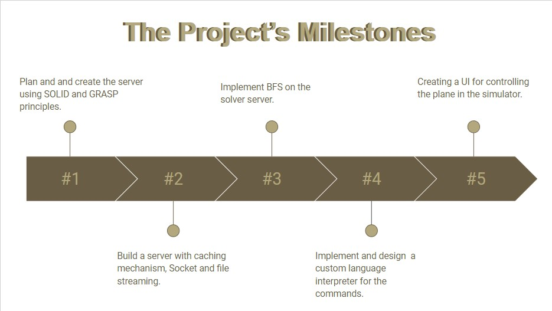
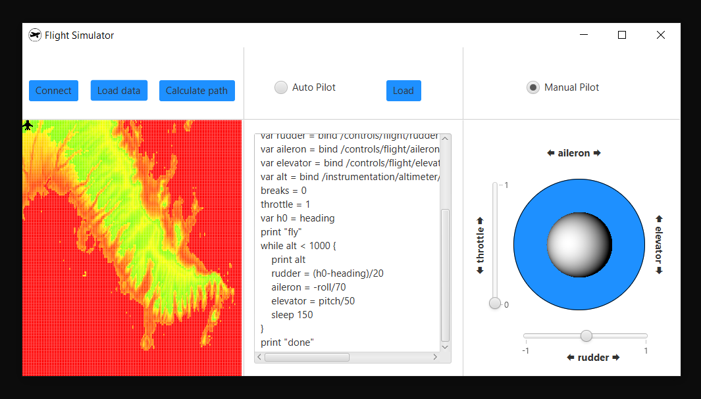

# flight-simulator

## Introduction
A project of `Advanced Software Development` course, written in Java.   
The project is consisted of 5 milestones which included working with:
* Design patterns
* Server and client side
* Desktop application.

## Design and functionality of the app

* `Connect` button will open a popup window with labels to input the connection details of the `Flight Gear Simulator`, Client, and Server (IP + PORT).
* `Load Data` button will open a folder of CSV files that are used as maps. When a CSV file is loaded then a map of the uploaded data is displayed. The map will be displayed in colors based on the height of each point on the map.
* `Calculate path` button will open a popup window and by entering IP and PORT we will connect to a server that solves search problems that we built in **milestones 1-3**. Clicking on any point on the map will set a destination for the aircraft, and the server will calculate the cheapest route to that point.
* `Load` button will open a folder of TEXT files that are used as scripts. When a script file with the airplane commands is loaded the data is displayed in the text area, and it will be used by the autopilot.
* `Auto pilot` button will move the aircraft to autopilot mode, the Interpreter that we built in **milestones 4** will execute the commands in the script we loaded with the `Load` button.
* `Manual Pilot` button will move the aircraft to manual mode, where the user controls the aircraft with the joystick and the sliders.

## Getting Started
These instructions will get you a copy of the project up and running on your local machine for development and testing purposes.
See deployment for notes on how to deploy the project on a live system.

## Prerequisites
What things you need to install the software and how to install them.
* Imports / technologies:
    * [JavaFX](https://openjfx.io/) - client application platform.
    * [Flight Gear](https://www.flightgear.org/) - open-source flight simulator.

### Built With
* [IntelliJ](https://www.jetbrains.com/idea/download/) - Java IDE
* [Scene Builder](https://gluonhq.com/products/scene-builder/) - Scene Builder

### Authors
* [David Katz](https://github.com/DavidKatz-il)
* [Tzvi Dissen](https://github.com/TheTzvi)
